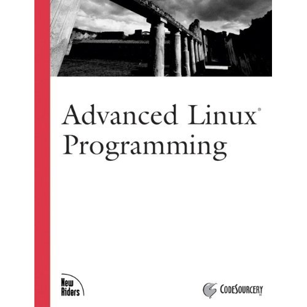

Title: Advanced Linux Programming 
Author: Mark L. Mitchell 
Pages:    340 
Progress:  69 
Link: [Amazon](http://www.amazon.com/Advanced-Linux-Programming-CodeSourcery-LLC/dp/0735710430) 

Advanced Linux Programming is divided into two parts. The first covers generic UNIX system services, but with a particular eye towards Linux specific information. This portion of the book will be of use even to advanced programmers who have worked with other Linux systems since it will cover Linux specific details and differences. For programmers without UNIX experience, it will be even more valuable. The second section covers material that is entirely Linux specific. These are truly advanced topics, and are the techniques that the gurus use to build great applications.
