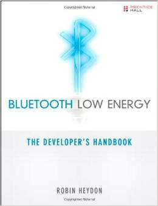

Title: Bluetooth Low Energy: The Developer's Handbook 
Author: Robin Heydon  
Pages:    368 
Progress:  Complete 
Link: [Amazon](http://www.amazon.com/Bluetooth-Low-Energy-Developers-Handbook/dp/013288836X) 

The First Complete Guide to Bluetooth Low Energy: How It Works, What It Can Do, and How to Apply It.
