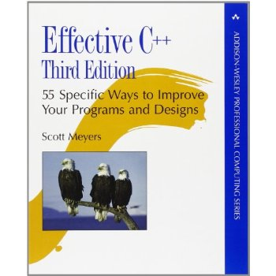

Title: Effective C++: 55 Specific Ways to Improve Your Programs and Designs  
Author: Scott Meyers 
Pages:    320 
Progress:  Chapter 8 
Link: [Amazon](http://www.amazon.com/Effective-Specific-Improve-Programs-Designs/dp/0321334876) 

The first two editions of Effective C++ were embraced by hundreds of thousands of programmers worldwide. The reason is clear: Scott Meyers’ practical approach to C++ describes the rules of thumb used by the experts — the things they almost always do or almost always avoid doing — to produce clear, correct, efficient code.
