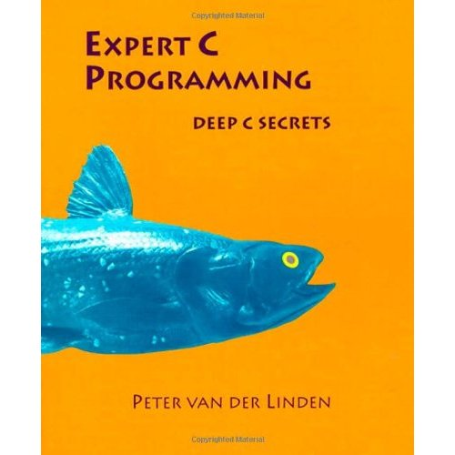

Title: Expert C Programming: Deep C Secrets 
Author: Peter van der Linden
Pages: 290
Progress: Complete 
Link: [Amazon](http://www.amazon.com/dp/0131774298/) 

Written for experienced C programmers who want to quickly pick up some of the insights and techniques of experts and master the fine arts of ANSI C, this volume passes on the wisdom of a highly experienced C compiler writer and his colleagues to help programmers reach new heights, and avoid common software pitfalls along the way.
