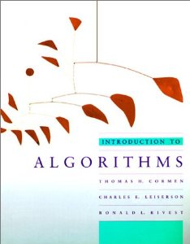

Title: MIT Introduction to Algorithms 3rd edition (2009) 
Author: Thomas H. Cormen, Charles E. Leiserson, Ronald L. Rivest, Clifford Stein
 
Pages: 1313 
Progress: 96 
Link: [Amazon](http://www.amazon.com/Introduction-Algorithms-Electrical-Engineering-Computer/dp/0262031418) 

If you had to buy just one text on algorithms, Introduction to Algorithms is a magnificent choice. The book begins by considering the mathematical foundations of the analysis of algorithms and maintains this mathematical rigor throughout the work. The tools developed in these opening sections are then applied to sorting, data structures, graphs, and a variety of selected algorithms including computational geometry, string algorithms, parallel models of computation, fast Fourier transforms (FFTs), and more.

This book's strength lies in its encyclopedic range, clear exposition, and powerful analysis. Pseudo-code explanation of the algorithms coupled with proof of their accuracy makes this book is a great resource on the basic tools used to analyze the performance of algorithms. 
