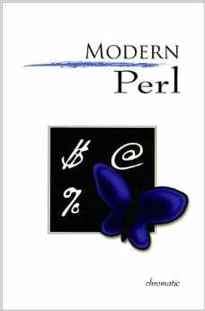

Title: Modern Perl 
Author: Chromatic 
Pages:    276 
Progress:  Complete 
Link: [Amazon](http://www.amazon.com/Modern-Perl-Chromatic/dp/0977920151) 

Perl 5 is a popular, powerful, and robust programming language. With countless satisfied developers, tens of thousands of freely available libraries, and continual improvements to the language and its ecosystem, modern Perl development can be easy, reliable, and fun.
