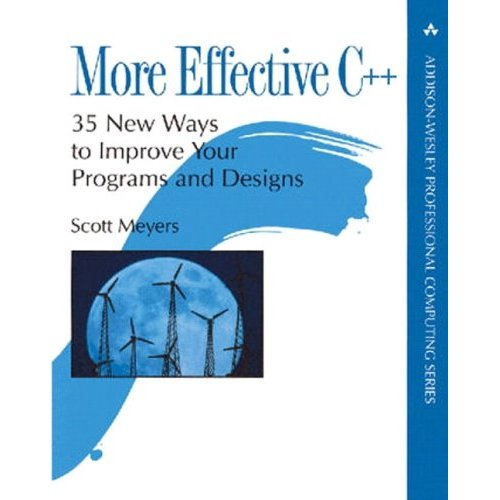

Title: More Effective C++: 35 New Ways to Improve Your Programs and Designs  
Author: Scott Meyers 
Pages:    337 
Progress:  Item 12 
Link: [Amazon](http://www.amazon.com/More-Effective-Improve-Programs-Designs/dp/020163371X) 

From the author of the indispensable Effective C++, here are 35 new ways to improve your programs and designs. Drawing on years of experience, Meyers explains how to write software that is more effective: more efficient, more robust, more consistent, more portable, and more reusable. In short, how to write C++ software that’s just plain better.
