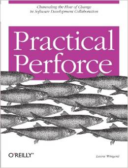

Title: Practical Perforce 
Author: Laura Wingerd 
Pages:  362 
Progress:  Complete 
Link: [Amazon](http://www.amazon.com/Practical-Perforce-Laura-Wingerd/dp/0596101856) 

When developers build software, they're able to keep track of all the different versions and all the components they use with software configuration management (SCM) systems. One of the more popular SCM products is Perforce.
