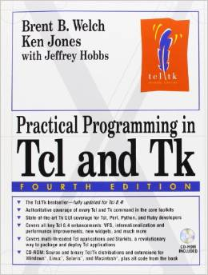

Title: Practical Programming in Tcl and Tk 
Author: Brent Welch 
Pages:    960 
Progress:  Complete 
Link: [Amazon](http://www.amazon.com/Practical-Programming-Tcl-4th-Edition/dp/0130385603) 

Practical Programming in Tcl/Tk is described as the "bible" for Tcl programmers. It is a guide to the Tcl/Tk programming language and GUI toolkit.
