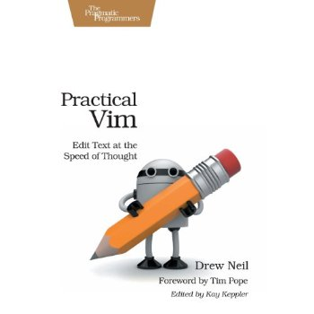

Title: Practical Vim: Edit Text at the Speed of Thought 
Author: Drew Neil 
Pages:    300 
Progress:  203 
Link: [Amazon](http://www.amazon.com/Practical-Vim-Thought-Pragmatic-Programmers/dp/1934356980/ref=sr_sp-atf_title_1_1/182-4131693-8870038) 

Vim is a fast and efficient text editor that will make you a faster and more efficient developer. It's available on almost every OS--if you master the techniques in this book, you'll never need another text editor. Practical Vim shows you 120 vim recipes so you can quickly learn the editor's core functionality and tackle your trickiest editing and writing tasks.
