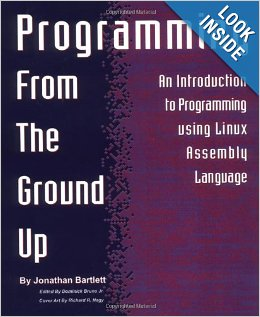

Title: Programming from the Ground Up 
Status: Complete 
Link: [Amazon](http://www.amazon.com/Programming-Ground-Up-Jonathan-Bartlett/dp/0975283847) 

My first serious attempt at learning x86 assembly. Thought the book is aimed towards maniacs who want to learn assembly as their first ever programming language I thought it was a great introduction for developers at any level. The book teaches x86 assembly within a Linux environment using the AT&T syntax. It covers all the basics from file operations to dynamic memory management. It gives a great insight into the inner workings of those things like printf and malloc that we take for granted.

