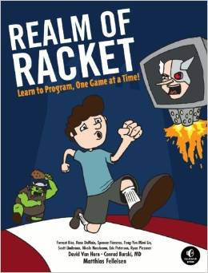

Title: Realm of Racket: Learn to Program, One Game at a Time! 
Author: Matthias Felleisen, Conrad Barski, David Van Horn 
Pages:    312 
Progress:  Complete 
Link: [Amazon](http://www.amazon.com/Sketchy-LISP-Nils-M-Holm/dp/1411674480) 

Racket is a descendant of Lisp, a programming language renowned for its elegance, power, and challenging learning curve. But while Racket retains the functional goodness of Lisp, it was designed with beginning programmers in mind. Realm of Racket is your introduction to the Racket language.
