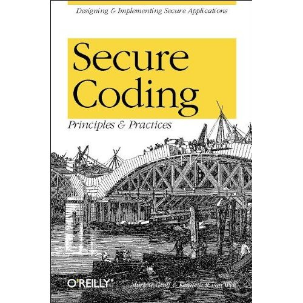

Title: Secure Coding: Principles and Practices 
Author: Mark G. Graff, Kenneth R. van Wyk 
Pages:    224 
Progress:  165 
Link: [Amazon](http://www.amazon.com/Secure-Coding-Principles-Mark-Graff/dp/0596002424) 

Practically every day, we read about a new type of attack on computer systems and networks. Viruses, worms, denials of service, and password sniffers are attacking all types of systems -- from banks to major e-commerce sites to seemingly impregnable government and military computers --at an alarming rate.
