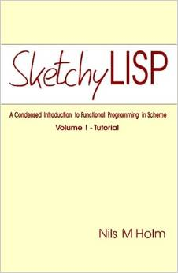

Title: Sketchy LISP 
Author: Nils M Holm 
Pages:    162 
Progress:  Complete 
Link: [Amazon](http://www.amazon.com/Sketchy-LISP-Nils-M-Holm/dp/1411674480) 

Sketchy LISP is a step-by-step introduction to functional programming in Scheme. By means of numerous examples of varying complexity, it takes the reader on an entertaining and informative tour through the language.
