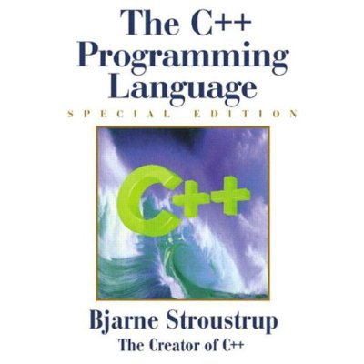

Title: The C++ Programming Language 
Author: Bjarne Stroustrup 
Pages:    1025 
Progress:  232 
Link: [Amazon](http://www.amazon.com/The-Programming-Language-Special-Edition/dp/0201700735) 

Written by Bjarne Stroustrup, the creator of C++, this is the world's most trusted and widely read book on C++.
