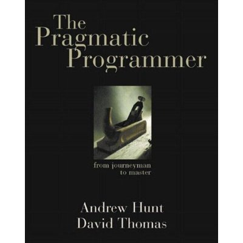

Title: The Pragmatic Programmer: From Journeyman to Master 
Author: Andrew Hunt 
Pages:    352 
Progress:  Complete 
Link: [Amazon](http://www.amazon.com/The-Pragmatic-Programmer-Journeyman-Master/dp/020161622X) 

Programmers are craftspeople trained to use a certain set of tools (editors, object managers, version trackers) to generate a certain kind of product (programs) that will operate in some environment (operating systems on hardware assemblies). Like any other craft, computer programming has spawned a body of wisdom, most of which isn't taught at universities or in certification classes. Most programmers arrive at the so-called tricks of the trade over time, through independent experimentation. In The Pragmatic Programmer, Andrew Hunt and David Thomas codify many of the truths they've discovered during their respective careers as designers of software and writers of code.
