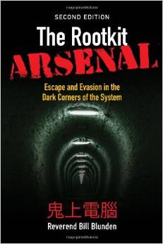

Title: The Rootkit Arsenal: Escape and Evasion in the Dark Corners of the System 
Author: Bill Blunden 
Pages:    784 
Progress:  Complete 
Link: [Amazon](http://www.amazon.com/The-Rootkit-Arsenal-Evasion-Corners/dp/144962636X) 

While forensic analysis has proven to be a valuable investigative tool in the field of computer security, utilizing anti-forensic technology makes it possible to maintain a covert operational foothold for extended periods, even in a high-security environment. 
