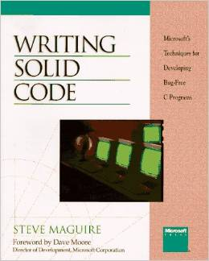

Title: Writing Solid Code 
Author:	Steve Maguire 
Pages:    256 
Progress:  1 
Link: [Amazon](http://www.amazon.com/Writing-Solid-Microsoft-Programming-Series/dp/1556155514) 

For professional intermediates to advanced C programmers who develop software, here is a focused and practical book based on writing bug-free programs in C.
